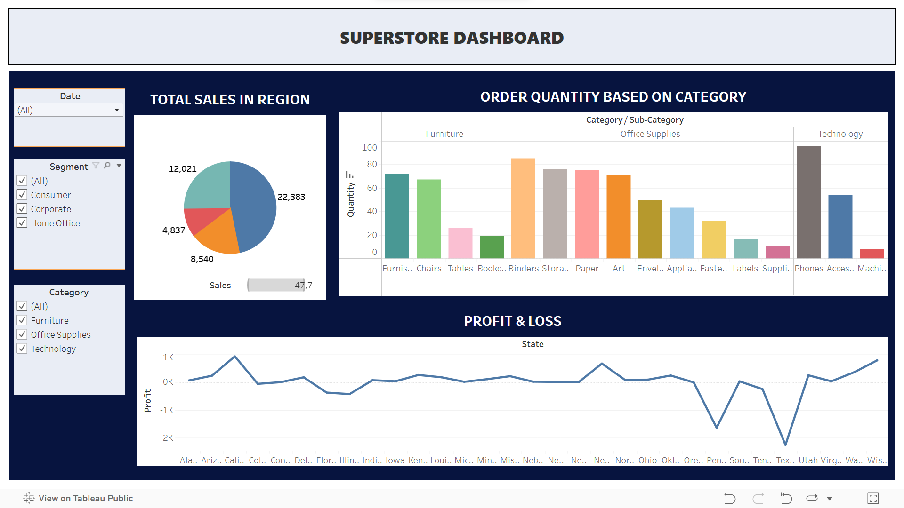

# 📊 <ins>Data Analytics Interactive Dashboard</ins>
 SuperStore Tableau Dashboard & Bike Sales Excel Dashboard
<html>

<iframe src="https://giphy.com/embed/bmQBu3aSF0DxadphkG" width="100%" height="100%" style="position:absolute" frameBorder="0" class="giphy-embed" allowFullScreen></iframe>

<a href="https://giphy.com/gifs/after-effects-animacion-koncepto-bmQBu3aSF0DxadphkG">via GIPHY</a>

</html>
# BikeSales Dashboard
This project is completely made using Excel.
The process involves- 
* Collecting the data
* Cleaning the data
* Using Pivot tables
* Visualization
* Dashboard

# SuperStore Tableau Project
This project is made using an Analytics tool- Tableau
The Process involves-
* Collecting the data
* Cleaning the data
* Exporting the data
* Creating Dashboard

View My Project on [Tableau](https://public.tableau.com/app/profile/ayesha.siddiqa8048/viz/SuperStoreDashboard_17095719073680/SUPERSTOREDASHBOARD)

 # 🤝 Stay Connected
 - 💼 **Linkedin:** [Ayesha Siddiqa](https://www.linkedin.com/in/ayesha67?utm_source=share&utm_campaign=share_via&utm_content=profile&utm_medium=android_app)
 - 📸 **Instagram:** [Follow me](https://www.instagram.com/__ayesh_7?igsh=OGQ5ZDc2ODk2ZA==)